#### Create VM Instance on Oracle Cloud

To use the Oracle Cloud, you will need to register a free account.
Select your home region (to me, here is the Canada Southeast (Montreal) - Home RegionRegion Identifier: ca-montreal-1).

Then you go to the Launch resources and select **Create a VM instance**:

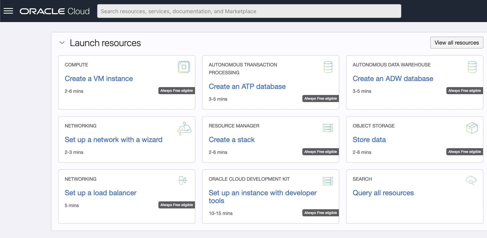

Configure your Image and Shape:

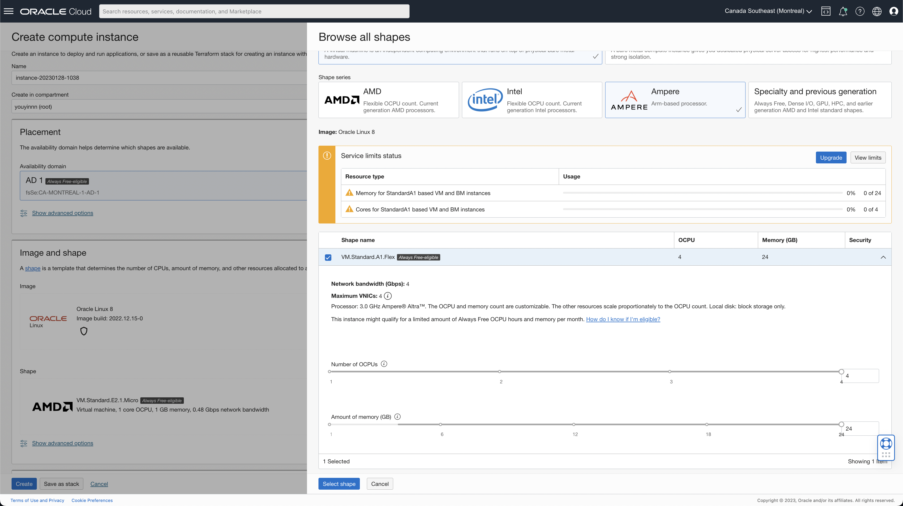

For free tier users, you have the `Always Free-eligible` on shape Ampere with four available CPUs and 24 GB available RAMs.

Please check: https://docs.oracle.com/en-us/iaas/Content/FreeTier/freetier_topic-Always_Free_Resources.htm#freetier_topic_Always_Free_Resources_Infrastructure

As the figure shows, you can allocate them into several instances or put them all into one instance.

Then, you set up your networks. You can **create a new virtual cloud network** or use the existing one if you have one. Change the name you like and leave others to default if you don't know what to do.

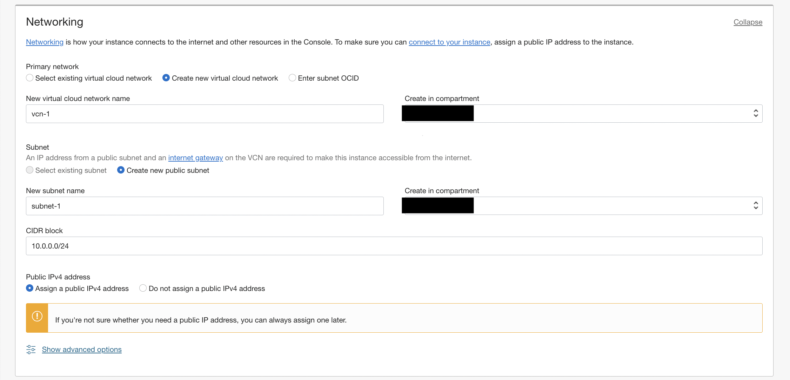

Add SSH Keys. As the figure shows, you can use the one that Oracle Cloud created for you.
Download the keys:

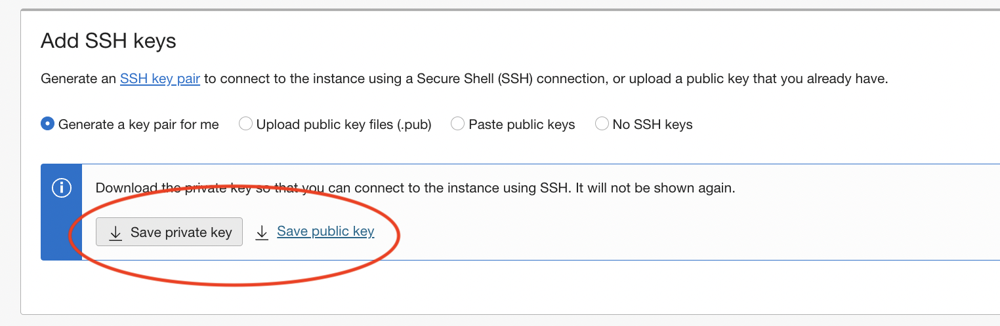

Configure your volume size, 200 GB total for free tier users.

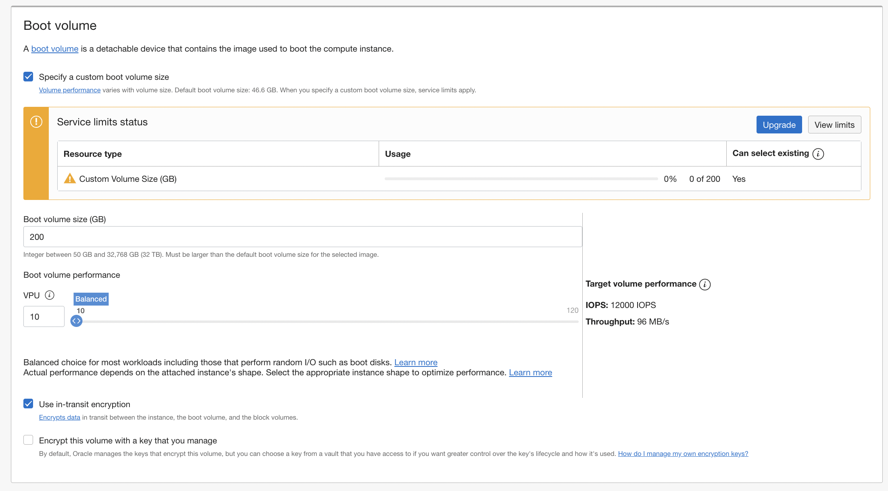

Configure advanced options if you need them:

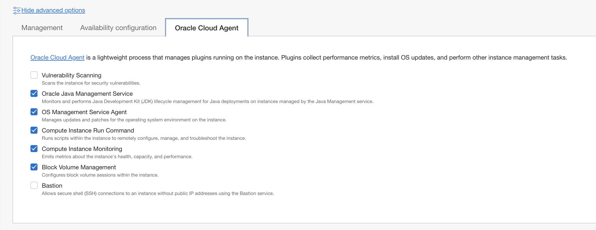

And finish the creation.

Once the instance is created, you will see your instance's public IP address on the top right:

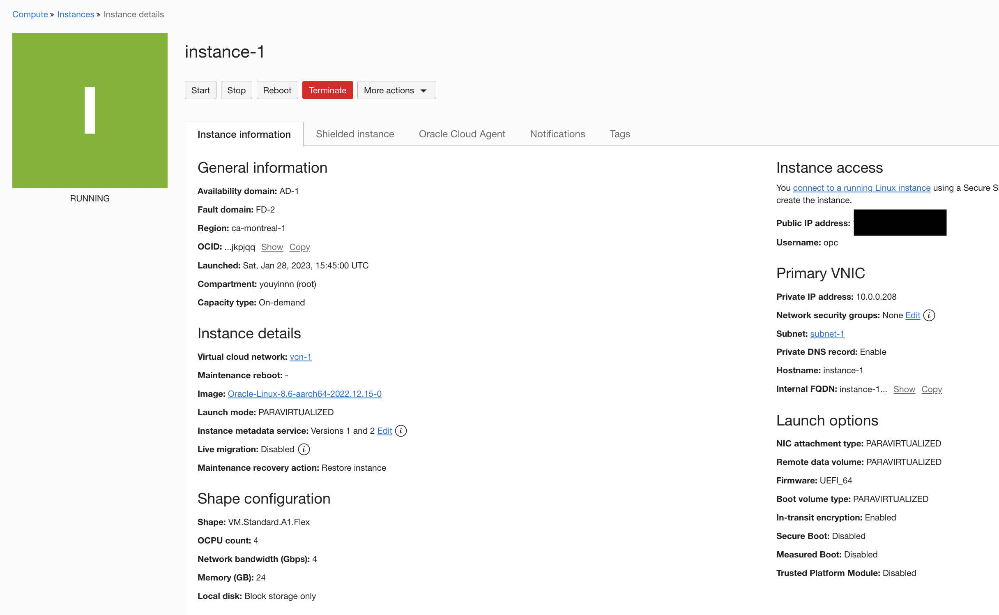

#### SSH Key Setup

Go to your user's home folder, and copy and paste the downloaded private and public keys to the `.ssh` folder.

```bash
# limit the access of the private key
chmod 400 ~/.ssh/your_private_key.key
```

And edit the config file under the `.ssh`:

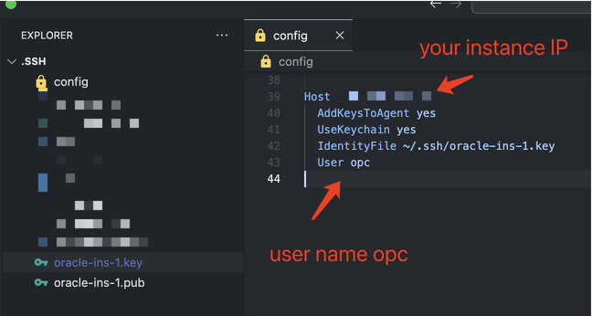

#### Login

You can refer to: https://docs.oracle.com/en/cloud/cloud-at-customer/occ-get-started/log-vm-using-ssh.html

Make sure you have the SSH installed in your environment.

```bash
ssh <public_ip_address>
```

#### VM Environment Setup

```bash
sudo yum update
```

##### Open JDK11

https://access.redhat.com/documentation/en-us/openjdk/11/html/installing_and_using_openjdk_11_on_rhel/installing-openjdk11-on-rhel8

```bash
sudo yum install java-11-openjdk
```

##### Maven 3.8

```bash
wget https://dlcdn.apache.org/maven/maven-3/3.8.7/binaries/apache-maven-3.8.7-bin.tar.gz
```

and follow: https://maven.apache.org/install.html

##### Network & Firewall Settings

If you want to expose the `8080` port to the public:

1. Go to the instance detail page:

   1. Click your `subnet-1` on the right middle:

      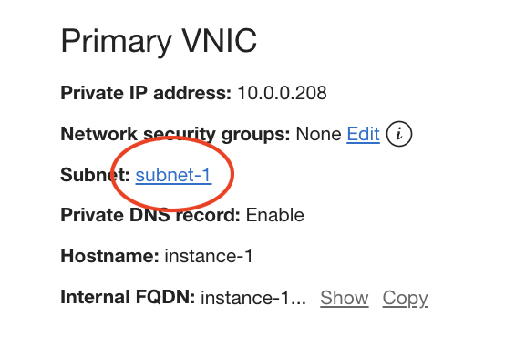

   2. Click `Default Security List for vcn-1`:

      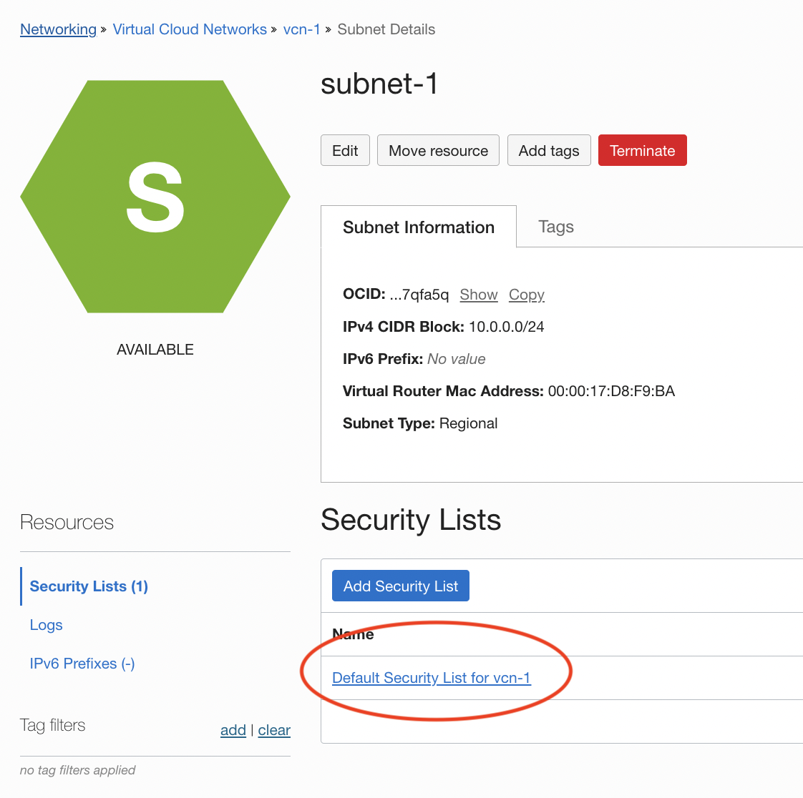

   3. Add Ingress Rules for port range 8080 ~ 10080 (whatever you need)

      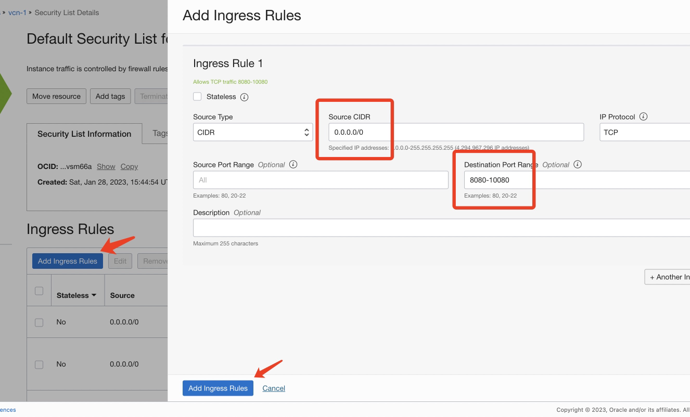

2. Open instance's firewall ports refer to:

   https://docs.fedoraproject.org/en-US/quick-docs/firewalld/#opening-ports-firewalld-fedora

   and

   https://www.thegeekdiary.com/how-to-open-a-ports-in-centos-rhel-7/

   ```bash
   sudo firewall-cmd --zone=public --add-port=8080/tcp --permanent
   sudo firewall-cmd --reload
   ```

   Check if it opened:

   ```bash
   sudo firewall-cmd --list-ports
   ```

#### Deploy the Jetty Helloworld

```bash
git clone https://github.com/youyinnn/distributed_system_jetty_helloworld.git
```

```bash
cd ~/distributed_system_jetty_helloworld
```

##### If you use the `jetty:run` command

```bash
mvn jetty:run
```

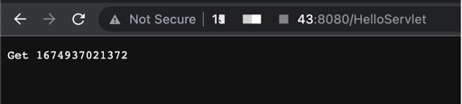

##### If you use the `exec:exec` command

```bash
mvn clean install exec:exec
```

Make sure you know where to configure the `port` and `contextPath`:

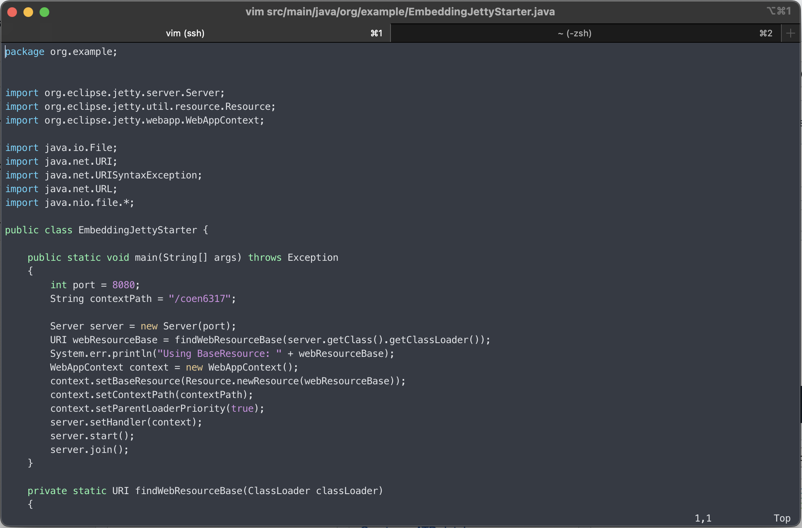

and visit:

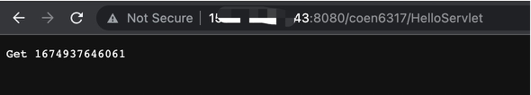
