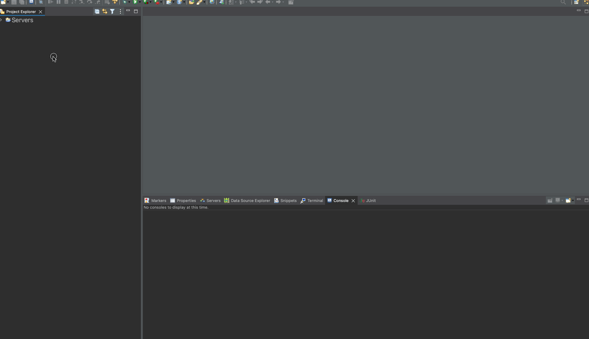
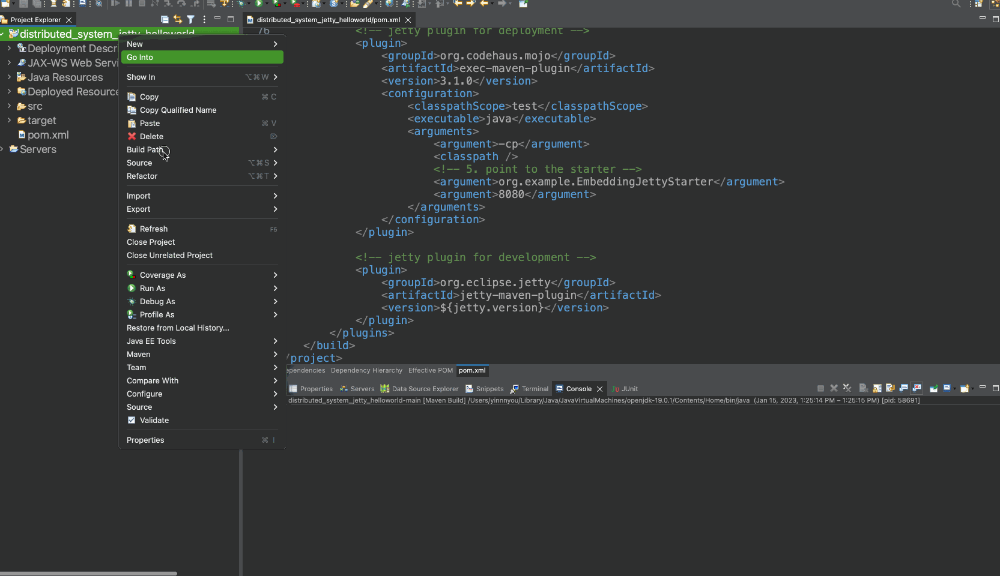
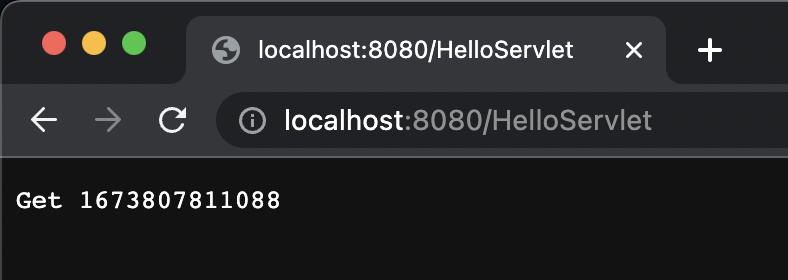

### Import To Eclipse Java EE Edition

1. Download the zip of this repo and unzip it.

2. Import the project into eclipse as a maven project.

   

3. Config Run for development.

   

4. Config Run for Deployment

   

5. Access servlet.

   

   As you have the servlet at `org.example.controller.HelloServlet.java`.


### CMD

#### To develop the project.

``` bash 
mvn jetty:run
```

> The server config for development is at `pom.xml:86`.
>
> Feel free to configure it.


#### To deploy the project.

``` bash
mvn clean install exec:exec
```
> The server config for deployment is in `org.example.EmbeddingJettyStarter`.
>
> Feel free to configure it.